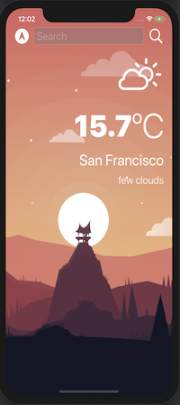

# Weather
iOS App Native to fetch live weather data

Applying the concepts:

* SF Symbols
* Dark Mode
* Protocols and Delegate Dessing Pattern
* Call APIs by making HTTP request with URLSession
* JSONDecoder
* Closures and Extensions
* Core Location to get the GPS data 

# Functionality
A weather app which allows you to get the live weather data for the current location using the phone's G.P.S. Plus, you'll also be able to type in the name of the city that you want to check the weather for and get the weather that way.
On top of all of that, it's also going to be dark-mode enabled, so you'll be able to switch between light and dark mode.

## Screenshots

|  Light      |  Dark      |
|------------|-------------|
|  |    |

